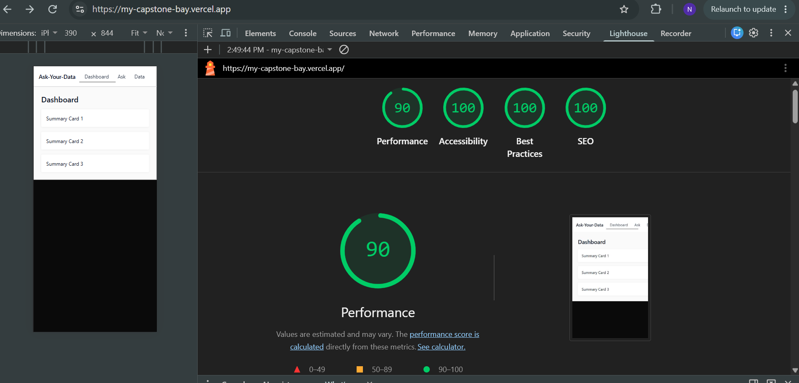
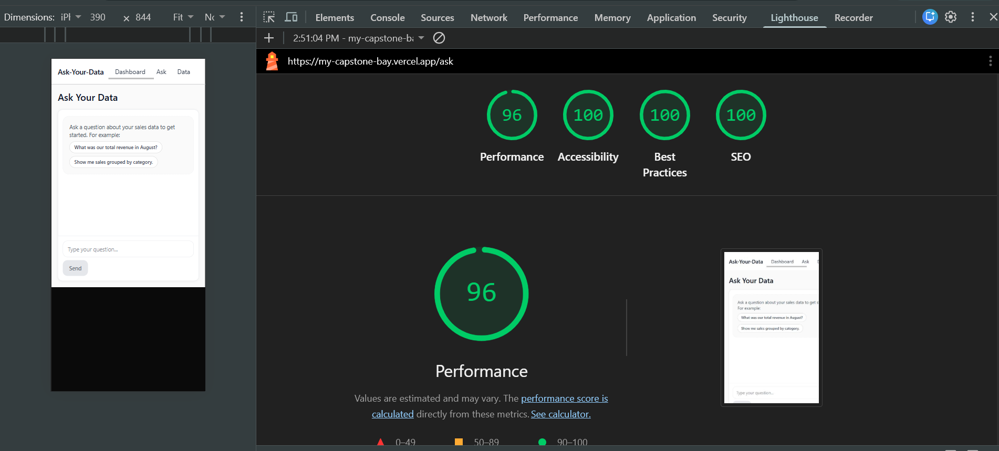
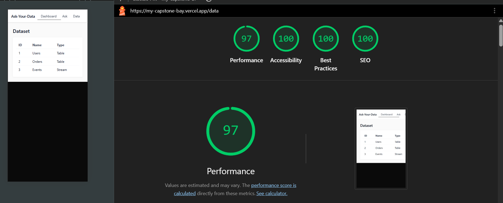
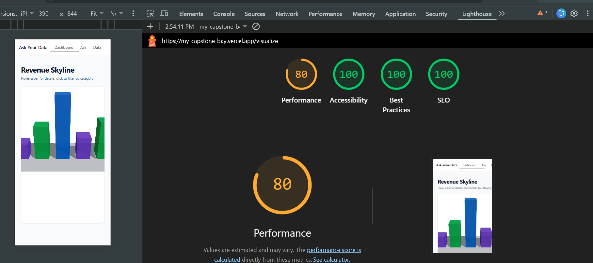
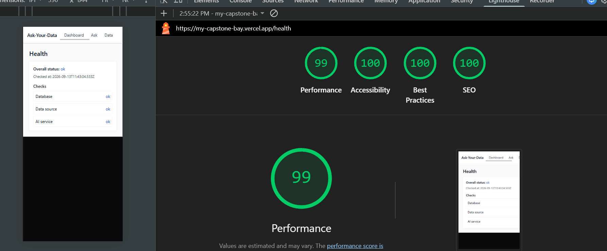
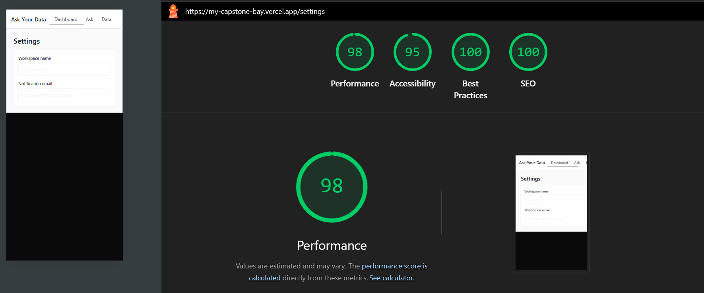
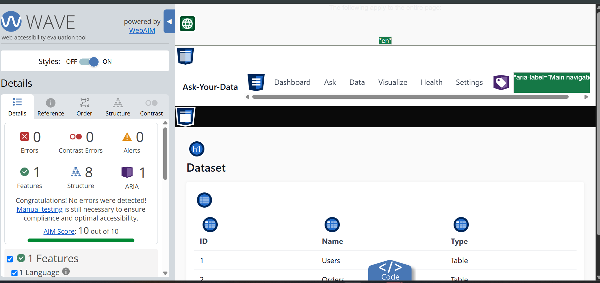
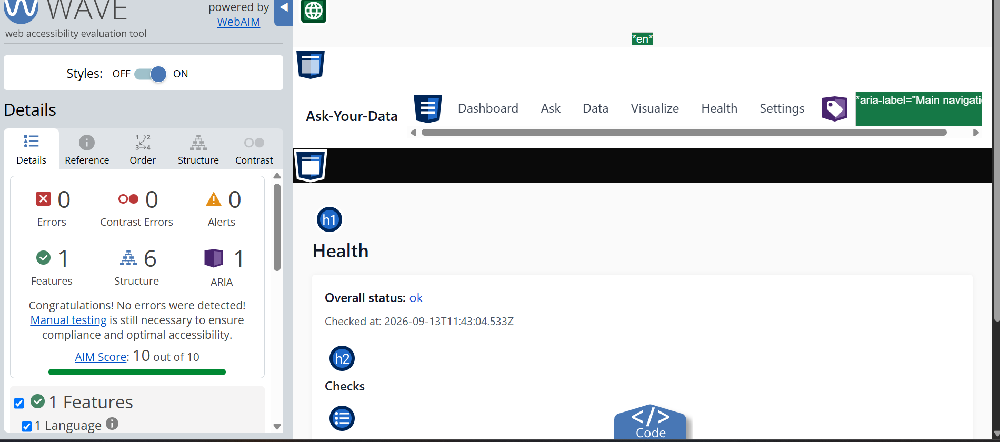
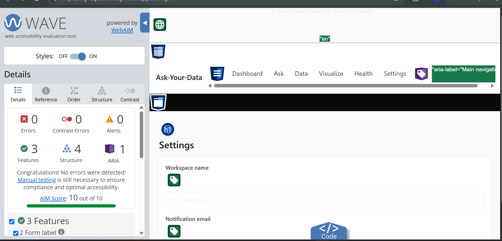

# AUDIT.md — Accessibility & Performance Audit

This audit covers the deployed capstone at
`https://my-capstone-bay.vercel.app`, across the Dashboard (`/`), Ask
(`/ask`), Data (`/data`), Visualize (`/visualize`), Health (`/health`), and
Settings (`/settings`) pages.

## Method

1. Ran Lighthouse (Mobile preset, all categories) via Chrome DevTools against
   the live deployment, on each page.
2. Ran the WAVE browser extension against all six pages.
3. Did a keyboard-only pass through the primary flow (Nav → Ask chat →
   Stop button), no mouse.
4. Fixed what was found, using AI-assisted edits, then re-ran each audit to
   verify the fix.

## Lighthouse (Mobile) — current scores, per page

| Page | Performance | Accessibility | Best Practices | SEO |
|---|---|---|---|---|
| `/` (Dashboard) | 80 | 100 | 100 | 100 |
| `/ask` | — | — | — | — |
| `/data` | — | — | — | — |
| `/visualize` | 68 | 100 | 100 | 100 |
| `/health` | — | — | — | — |
| `/settings` | — | — | — | — |

**Homepage before/after (the page that changed the most):**

| Metric | Before | After |
|---|---|---|
| Performance | 70 | 80 |
| Accessibility | 95 | 100 |
| Total Blocking Time | 3,330 ms | ~860 ms |

**Note on `/visualize`:** its lower Performance score (68) is expected — it
loads Three.js and React Three Fiber to render the 3D scene, which are
genuinely large libraries. This is a documented tradeoff for that one
feature page, not a site-wide problem — confirmed by the fact that the
homepage (which shares the same Nav and layout, but no 3D content) scores
80, once its unrelated prefetch bug (below) was fixed.

## WAVE results

| Page | Errors (before) | Contrast Errors (before) | Errors (after) | Contrast Errors (after) | AIM Score (after) |
|---|---|---|---|---|---|
| `/` | 0 | 0 | 0 | 0 | 10/10 |
| `/ask` | 0 | 1 | 0 | 1 (justified) | 9.4/10 |
| `/data` | 0 | 9 | 0 | 0 | 10/10 |
| `/visualize` | 0 | 0 | 0 | 0 | 10/10 |
| `/health` | 0 | 4 | 0 | 0 | 10/10 |
| `/settings` | 2 | 0 | 0 | 0 | 10/10 |

**Settings errors (fixed):** two `<label>` elements had no `htmlFor`
attribute and their corresponding `<input>` elements had no matching `id`,
so the labels were "orphaned" — not programmatically connected to their
inputs.

**Data / Health contrast errors (fixed):** table cells and status/name spans
had no explicit text color set, inheriting a color that failed contrast
against their white backgrounds.

**Justified alert on `/ask` (not changed):** WAVE flags a visually-hidden
`sr-only` label ("Ask a question") for low contrast between its text and
background color. This is a false positive: the label is intentionally
hidden from sighted users via `clip-path`/`position: absolute` (the
standard `sr-only` pattern, also used by shadcn/ui and most component
libraries), so its color contrast is irrelevant — sighted users never see
it, and screen reader users receive the accessible name regardless of
color. No change needed.

## Keyboard-only pass

**Before:** Tabbing through the site produced no visible focus indicator on
any nav link — the browser's default focus outline was not rendering
visibly against the site's styling, leaving keyboard users with no way to
see which element currently had focus.

**After:** A clear blue focus outline now appears on every nav link and
interactive element as focus moves through them. The primary flow — Tab to
a nav link, press Enter to navigate, Tab into the Ask chat, type and send a
question, Tab to the Stop button mid-stream and press Enter/Space to stop —
is fully completable by keyboard alone.

## Changes made

1. **Disabled Next.js `<Link>` prefetching** for `/ask` and `/visualize` in
   `app/components/Nav.jsx`. Next.js prefetches the JS for every visible
   link by default, so Three.js and the AI SDK were being silently
   downloaded on every page load, even the homepage. Adding
   `prefetch={false}` to just those two links dropped homepage Total
   Blocking Time from 3,330 ms to ~860 ms.
2. **Added explicit text colors** to the Dashboard summary cards
   (`app/page.js`), the Data table's `<td>` cells (`app/data/page.js`), and
   the Health page's status/name spans (`app/health/page.js`) — fixing 13
   contrast errors total.
3. **Connected form labels to inputs** in `app/settings/page.js` with
   matching `htmlFor`/`id` pairs, fixing both missing-form-label errors.
4. **Added visible keyboard focus styles**: a global `:focus-visible` rule
   in `app/globals.css` covering every interactive element site-wide, plus
   explicit focus-visible classes on each Nav link.

## AI-specific accessibility

- The Ask chat's message list container has `aria-live="polite"` set, so
  streamed assistant responses are announced to screen reader users as they
  arrive, without interrupting whatever they're currently doing.
- The **Stop** button appears in the tab order whenever a response is
  streaming and is reachable and activatable via keyboard (Tab, then
  Enter/Space) — verified in the keyboard-only pass above.

## Summary of measurable deltas

| Metric | Before | After |
|---|---|---|
| Homepage Performance | 70 | 80 |
| Homepage Accessibility | 95 | 100 |
| Homepage Total Blocking Time | 3,330 ms | ~860 ms |
| WAVE Errors (site-wide) | 2 | 0 |
| WAVE Contrast Errors (site-wide) | 14 | 1 (justified false positive) |
| Keyboard focus visibility | None | Visible on all interactive elements |